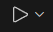

# TOTP-AUTHENTICATION DEMO

## Correr `WebApp`
1. Abrir Visual la carpeta de `WEBAPP`

2. ejecutar los comandos.
```bash
  npm install
```

```bash
  ng serve
```

3. Ir a [localhost:4200](http://localhost:4200)
4. Para configurar apis: abrir el documento `src\app\constants\api.config.ts`
5. Ajustar la constante de `baseHref` de ``const baseHref = '.'`` a ``const baseHref = 'http://localhost:8080'``
esto hara que la aplicacion apunte a la url de `localhost:8080` y cuando compilemo debe estar ajustada a `.`


## Correr `Server`
1. Abrir Visual en la carpeta `server`

2. Configuramos el archivo de la ruta `src\main\resources\application.properties` modificamos la propiedad de `server.app.address` por la ip de nuestro equipo.
```bash
    ipconfig
``` 
Copiamos el valor de IPv4 Address y lo ponemos en la configuración
`server.app.address=http://192.168.x.xx:8080/api/v1/totp/scan/{1}`

3. Si tenemos las extenciones de Java de microsoft apareceran los apartados `JAVA PROJECT` y `MAVEN` en el apartado de explorador. Abrimos el de `MAVEN`

4. Ejecutamos `clean` y `install`
5. Abrimos el archivo principal de la app `src\main\java\com\authentication\server\ServerApplication.java`
6. En la pantalla de visor de archivos aparece el icono de play 
7. Seleccionamos `Run Java` o `Debu`
## Compilar App
Pasos para compilar app     

1. Ejecutamos el comando 
```bash
   npm build
```
Con la configuracion del angular.json 
```json
        "build": {
          "builder": "@angular/build:application",
          "options": {
            "outputPath": {
            "base": "../server/src/main/resources/static",
            "browser": ""
            },
          }
        }
```
La ruta `../server/src/main/resources/static` es la ruta donde el build de la app de angular se almacenara, este folder esta en el modulo de Server, en documentos estaticos. estos se exponen desde el servidor de java, hara que las apis y el front esten en la misma url con el puerto.
